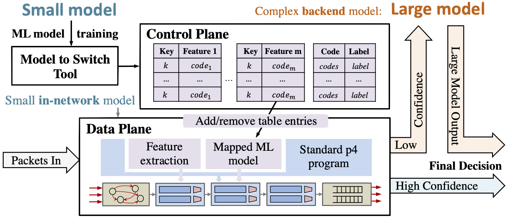

# IIsy: Practical & Hybrid In-network ML Classification

IIsy introcuces hybrid in-network ML deployment which employs a small in-network ML model on the network device and a large ML model over the end-point. This is the artifact for the paper "[IIsy: Hybrid In-Network Classification Using Programmable Switches](https://doi.org/10.1109/TNET.2024.3364757)" in IEEE/ACM Transactions on Networking (with early arXiv version named "[IIsy: Practical In-Network Classification](https://arxiv.org/pdf/2205.08243)"). 💡**IIsy's model mapping for in-network ML is now integrated in Planter [link](https://github.com/In-Network-Machine-Learning/Planter).**



## How to test the hybrid model

- Change the dataset. Making sure the new data loader has the ```load_data``` function.
		
     ```
     vim src/<dataset name>_dataset.py
     ```
     Open the main file by using ```vim main.py``` and change the load data name code such as:
  
     ```
     from src.Iris_dataset import load_data
     ...
     features_subset = ['SepalLengthCm', 'SepalWidthCm', 'PetalLengthCm', 'PetalWidthCm']
     ...
     X_train, y_train, X_test, y_test, used_features = load_data(4, './Data')
     ```
    
- Change the parameters (e.g., model size, depth, and used features) for the small in-network ML model on the network device and a large ML model over the end-point.
		
     ```
     vim main.py
     ```
- Run the simulation.
	
    ```
    python3 main.py
    ``` 
    The algorithm will output the switch fraction and accuracy of both model and syatem under different confidence thresholds.
    
    ```
    ...
    Switch confidence th=0.64: AUC 0.981143 , Macro-F1  0.963309 , Accuracy 0.984522 , Precision 0.983752 , Recall 0.998776 , Precision normal switch 0.985413 , Precision normal server 0.999157  , Precision anomaly switch 0.000000 , Precision anomaly server 0.912983 , Switch Fraction 0.848257
    Switch confidence th=0.66: AUC 0.981143 , Macro-F1  0.963309 , Accuracy 0.984522 , Precision 0.983752 , Recall 0.998776 , Precision normal switch 0.985413 , Precision normal server 0.999157  , Precision anomaly switch 0.000000 , Precision anomaly server 0.912983 , Switch Fraction 0.848257
    Switch confidence th=0.68: AUC 0.981144 , Macro-F1  0.963354 , Accuracy 0.984540 , Precision 0.983774 , Recall 0.998774 , Precision normal switch 0.985442 , Precision normal server 0.999164  , Precision anomaly switch 0.000000 , Precision anomaly server 0.912990 , Switch Fraction 0.848227
    Switch confidence th=0.70: AUC 0.981144 , Macro-F1  0.963354 , Accuracy 0.984540 , Precision 0.983774 , Recall 0.998774 , Precision normal switch 0.985442 , Precision normal server 0.999164  , Precision anomaly switch 0.000000 , Precision anomaly server 0.912990 , Switch Fraction 0.848227
    ...
    ``` 
    
    
## Reporting a Bug
Please submit an issue with the appropriate label on [Github](../../issues).

## License

The files are licensed under Apache License: [LICENSE](./LICENSE). The text of the license can also be found in the LICENSE file.

## Citation
If you use this code, please cite our [papers](https://dl.acm.org/doi/abs/10.1145/3472716.3472846):

```
@article{zheng2024iisy,
  title={{IIsy: Hybrid In-Network Classification Using Programmable Switches}},
  author={Zheng, Changgang and Xiong, Zhaoqi and Bui, Thanh T and Kaupmees, Siim and Bensoussane, Riyad and Bernabeu, Antoine and Vargaftik, Shay and Ben-Itzhak, Yaniv and Zilberman, Noa},
  journal={IEEE/ACM Transactions on Networking},
  year={2024}
}

@article{zheng2024automating,
  title={{Planter: Rapid Prototyping of In-Network Machine Learning Inference}},
  author={Zheng, Changgang and Zang, Mingyuan and Hong, Xinpeng and Perreault, Liam and Bensoussane, Riyad and Vargaftik, Shay and Ben-Itzhak, Yaniv and Zilberman, Noa},
  journal={ACM SIGCOMM Computer Communication Review},
  year={2024}
}
```


We are also excited to introduce several IIsy related papers ([Survey](https://ora.ox.ac.uk/objects/uuid:ffa3130b-140d-4e19-973a-c4800cfacf70/download_file?file_format=application%2Fpdf&safe_filename=Zheng_et_al_2023_In-network_machine_learning.pdf&type_of_work=Journal+article), [DINC](https://ora.ox.ac.uk/objects/uuid:30f4bf57-95bb-4477-aa4d-77d0b9ce76b0/download_file?file_format=application%2Fpdf&safe_filename=Zheng_et_al_2023_DINC_toward_distributed.pdf&type_of_work=Conference+item), and [QCMP](https://ora.ox.ac.uk/objects/uuid:43a1cd2a-0b5b-4570-9e88-bbb4d8df43a6/files/sgq67js54f)) in the [link](https://github.com/In-Network-Machine-Learning/Planter/blob/main/Docs/Projects.md).

## Acknowledgments
The following people contributed to this project: Changgang Zheng, Zhaoqi Xiong, Thanh T Bui, Siim Kaupmees, Riyad Bensoussane, Antoine Bernabeu, Shay Vargaftik, Yaniv Ben-Itzhak, and Noa Zilberman. This work was partly funded by VMware, EU Horizon SMARTEDGE (101092908, UKRI 10056403), Leverhulme Trust (ECF-2016-289) and Isaac Newton Trust. We acknowledge support from Intel. 
